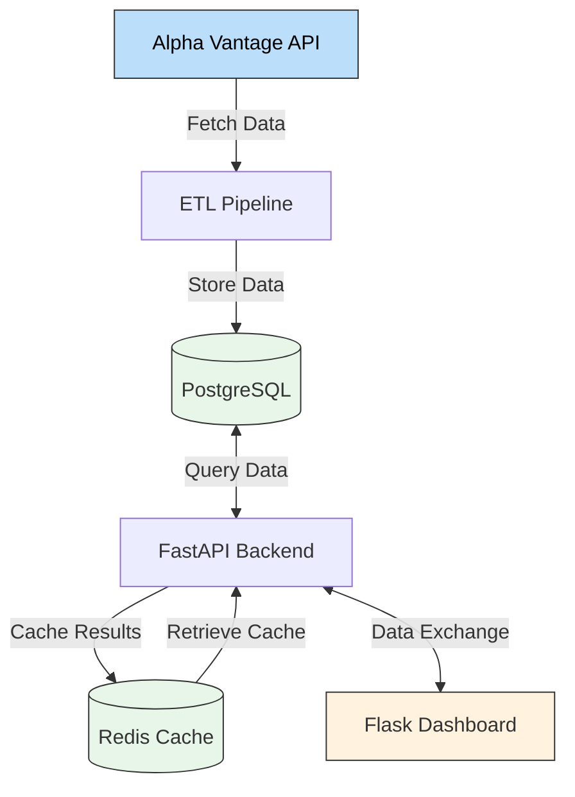

# Federal Funds Rate Analytics Platform

A comprehensive financial analytics platform for tracking and analyzing Federal Reserve interest rate changes. This system provides real-time insights into monetary policy trends through automated data collection, advanced analytics, and interactive visualizations.

## Architecture



## Tech Stack

- **Backend**: Python 3.11, FastAPI, SQLAlchemy
- **Database**: PostgreSQL 15
- **Cache**: Redis 7
- **Frontend**: Flask, Plotly.js
- **Containerization**: Docker, Docker Compose
- **Data Processing**: Pandas, NumPy
- **API**: Alpha Vantage Federal Reserve Data
- **Scheduling**: Python Schedule

## Quick Start

### Prerequisites

- Docker and Docker Compose
- Alpha Vantage API key (free at [alphavantage.co](https://www.alphavantage.co/support/#api-key))

### Setup and Run

1. **Clone the repository**

   ```bash
   git clone https://github.com/utkuyucel/fundratetracker.git
   cd fundratetracker
   ```

2. **Configure environment**

   ```bash
   cp .env.example .env
   # Edit .env to add your Alpha Vantage API key
   ```

3. **Start all services**

   ```bash
   docker-compose up -d
   ```

4. **Access the applications**

   - Dashboard: [http://localhost:5001](http://localhost:5001)
   - API Documentation: [http://localhost:8000/docs](http://localhost:8000/docs)

5. **Test the API**

   ```bash
   curl http://localhost:8000/health
   curl http://localhost:8000/api/rates/latest
   ```

## Project Structure

```
fundratetracker/
├── docker-compose.yml
├── Dockerfile              # FastAPI app Dockerfile
├── .env.example
├── README.md
├── app/                    # FastAPI backend service
│   ├── main.py
│   ├── etl_pipeline.py
│   ├── database.py
│   ├── analytics.py
│   ├── scheduler.py
│   └── requirements.txt
├── dashboard/              # Flask dashboard service
│   ├── Dockerfile
│   ├── app.py
│   ├── requirements.txt
│   ├── templates/
│   └── static/
└── sql/
    └── init.sql
```

## API Endpoints

### Core Endpoints

- `GET /` - API information and version
- `GET /health` - Health check status

### Data Endpoints

- `GET /api/rates/latest` - Get the most recent Federal Funds Rate
- `GET /api/rates/historical` - Historical data with optional date filtering
  - Query params: `start_date`, `end_date`, `limit`
  - Date format: `YYYY-MM-DD`

### Analytics Endpoints

- `GET /api/analytics/summary` - Comprehensive statistical summary
- `GET /api/analytics/moving-averages` - Moving averages (30, 90, 365 days)

### Pipeline Management

- `POST /api/pipeline/trigger` - Manually trigger ETL pipeline

## Monitoring and Logs

```bash
# View all service logs
docker-compose logs -f

# View specific service logs
docker-compose logs -f app
docker-compose logs -f postgres
docker-compose logs -f redis
docker-compose logs -f dashboard

# Check service status
docker-compose ps
```

## Data Initialization

The project includes automatic database initialization:

- **SQL Schema**: The `sql/init.sql` file contains all necessary table definitions and indexes
- **Auto-Setup**: When PostgreSQL starts for the first time, it automatically executes the initialization script
- **Data Population**: The ETL pipeline will populate data from Alpha Vantage API when triggered

### Manual Data Population (Optional)

If you want to immediately populate data without waiting for the scheduler:

```bash
# Trigger ETL pipeline manually via API
curl -X POST http://localhost:8000/api/pipeline/trigger

# Or run ETL directly inside the container
docker-compose exec app python -c "import asyncio; from etl_pipeline import FedRateETL; asyncio.run(FedRateETL().run_pipeline())"
```

## Troubleshooting

### Common Issues

1. **API Key Not Set**: Ensure your Alpha Vantage API key is properly set in `.env`
2. **Database Connection**: Check PostgreSQL health with `docker-compose logs postgres`
3. **Port Conflicts**: Ensure ports 5432, 6379, 8000, and 5001 are available
4. **API Rate Limits**: Alpha Vantage has rate limits; the ETL includes error handling

### Health Checks

```bash
# Check API health
curl http://localhost:8000/health

# Check dashboard health  
curl http://localhost:5001/health

# Check database connection
docker-compose exec postgres pg_isready -U dataeng -d fed_analytics
```

## License

This project is licensed under the MIT License - see the LICENSE file for details.
